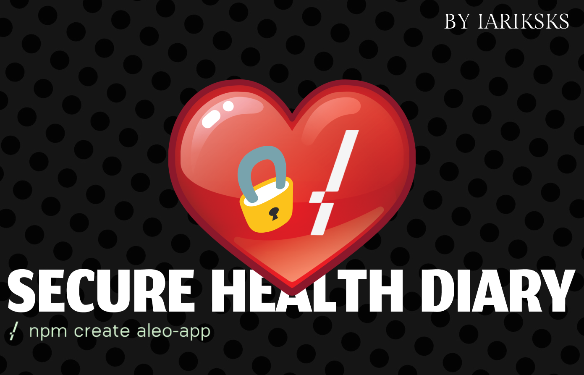

# Notepad Smart Contract on Aleo

**Description:**  
The Secure Health Diary is a blockchain-based contract that allows users to maintain records related to their health, medications, and medical test results without fearing data leaks. Users have full control over their health data, ensuring privacy and trustworthiness.

### Functions:

1. **Add Entry** (`add_entry`):  
   Allows users to add a health-related entry consisting of date, health note, medications, and test results. 
   
   **Inputs:**  
   - `user_address`: Address of the user adding the entry.
   - `date`: Date of the entry.
   - `health_note`: Notes or observations about health on the given date.
   - `medications`: Details of medications taken.
   - `test_results`: Medical test results, if any.

2. **View Entry** (`view_entry`):  
   Allows users (or permitted addresses) to view a specific health-related entry.
   
   **Inputs:**  
   - `user_address`: Address of the user whose entry needs to be viewed.
   - `requester_address`: Address of the user requesting to view the entry.

### Usage:

To use the Secure Health Diary:

1. **Deploy the Contract:**  
   Deploy the contract to the desired blockchain platform.

2. **Add Health Entry:**  
   Call the `add_entry` function and provide the necessary details about health, medications, and test results.

3. **View Health Entry:**  
   Call the `view_entry` function. Only the owner (or permitted addresses) can view the entries.

### Security:

The primary goal of this contract is to maintain user data privacy. Only the user (or addresses the user explicitly grants permission to) can access their health entries.
